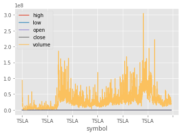
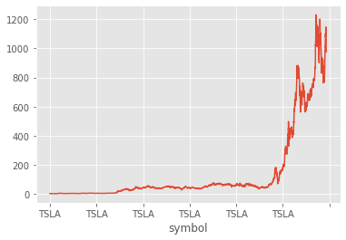

```python
import wget
```


    ---------------------------------------------------------------------------

    ModuleNotFoundError                       Traceback (most recent call last)

    <ipython-input-1-381d77ba2736> in <module>
    ----> 1 import wget
    

    ModuleNotFoundError: No module named 'wget'


```python
from pip._internal import main
main(['install', 'wget'])
import wget
```

    WARNING: pip is being invoked by an old script wrapper. This will fail in a future version of pip.
    Please see https://github.com/pypa/pip/issues/5599 for advice on fixing the underlying issue.
    To avoid this problem you can invoke Python with '-m pip' instead of running pip directly.
    

    Collecting wget
      Downloading wget-3.2.zip (10 kB)
    Building wheels for collected packages: wget
      Building wheel for wget (setup.py): started
      Building wheel for wget (setup.py): finished with status 'done'
      Created wheel for wget: filename=wget-3.2-py3-none-any.whl size=9686 sha256=d9478a31f868c22c43215f9e5a5b4ac21263125aac30c00459422dcde207ad4b
      Stored in directory: c:\users\jon\appdata\local\pip\cache\wheels\bd\a8\c3\3cf2c14a1837a4e04bd98631724e81f33f462d86a1d895fae0
    Successfully built wget
    Installing collected packages: wget
    Successfully installed wget-3.2
    


```python
try:
    import wget
except: 
    from pip._internal import main
    main(['install', 'wget'])
    import wget
```


```python
import datetime as dt
import matplotlib.pyplot as plt
from matplotlib import style
import pandas as pd
try:
    import pandas_datareader.data as web
except: 
    from pip._internal import main
    main(['install', 'pandas_datareader'])
    import pandas_datareader.data as web
```

    WARNING: pip is being invoked by an old script wrapper. This will fail in a future version of pip.
    Please see https://github.com/pypa/pip/issues/5599 for advice on fixing the underlying issue.
    To avoid this problem you can invoke Python with '-m pip' instead of running pip directly.
    

    Collecting pandas_datareader
      Downloading pandas_datareader-0.10.0-py3-none-any.whl (109 kB)
    Requirement already satisfied: pandas>=0.23 in e:\programs\utility\anaconda\lib\site-packages (from pandas_datareader) (1.0.5)
    Requirement already satisfied: requests>=2.19.0 in e:\programs\utility\anaconda\lib\site-packages (from pandas_datareader) (2.24.0)
    Requirement already satisfied: lxml in e:\programs\utility\anaconda\lib\site-packages (from pandas_datareader) (4.5.2)
    Requirement already satisfied: pytz>=2017.2 in e:\programs\utility\anaconda\lib\site-packages (from pandas>=0.23->pandas_datareader) (2020.1)
    Requirement already satisfied: python-dateutil>=2.6.1 in e:\programs\utility\anaconda\lib\site-packages (from pandas>=0.23->pandas_datareader) (2.8.1)
    Requirement already satisfied: numpy>=1.13.3 in e:\programs\utility\anaconda\lib\site-packages (from pandas>=0.23->pandas_datareader) (1.18.5)
    Requirement already satisfied: urllib3!=1.25.0,!=1.25.1,<1.26,>=1.21.1 in e:\programs\utility\anaconda\lib\site-packages (from requests>=2.19.0->pandas_datareader) (1.25.9)
    Requirement already satisfied: certifi>=2017.4.17 in e:\programs\utility\anaconda\lib\site-packages (from requests>=2.19.0->pandas_datareader) (2020.6.20)
    Requirement already satisfied: idna<3,>=2.5 in e:\programs\utility\anaconda\lib\site-packages (from requests>=2.19.0->pandas_datareader) (2.10)
    Requirement already satisfied: chardet<4,>=3.0.2 in e:\programs\utility\anaconda\lib\site-packages (from requests>=2.19.0->pandas_datareader) (3.0.4)
    Requirement already satisfied: six>=1.5 in e:\programs\utility\anaconda\lib\site-packages (from python-dateutil>=2.6.1->pandas>=0.23->pandas_datareader) (1.15.0)
    Installing collected packages: pandas-datareader
    Successfully installed pandas-datareader-0.10.0
    


```python
style.use('ggplot')
```


```python
start = dt.datetime(2000, 1, 1)
end = dt.datetime(2016, 12, 31)
```


```python
class YahooDailyReader():
    
    def __init__(self, symbol=None, start=None, end=None):
        import datetime, time
        
        self.symbol = symbol
        
        # initialize start/end dates if not provided
        if end is None:
            end = datetime.datetime.today()
        if start is None:
            start = datetime.datetime(2010,1,1)
        
        self.start = start
        self.end = end
        

        
    def read(self):
        import requests, re, json
        try:
            import yfinance
        except: 
            from pip._internal import main
            main(['install', 'yfinance'])
            import yfinance   
        
        r = yfinance.Ticker(self.symbol)
        history = r.history(start=self.start, end=self.end, interval="1d", frequency="1d")
        
        df = pd.DataFrame(history)
        
        df.insert(0, 'symbol', self.symbol)

        df = df.dropna(subset=['Close'])
        
        df = df.reset_index()
        
        df = df.rename(columns={ "Date": "date", 
                           "High": "high",
                           "Low": "low",
                           "Open": "open",
                           "Close": "close",
                           "Volume": "volume"})
        
        df = df[['symbol', 'date', 'high', 'low', 'open', 'close', 'volume']]
        df = df.set_index('symbol')
        return df
```


```python
ydr = YahooDailyReader('TSLA')
df = ydr.read()
```


```python
print(df.head(6))
```

                 date   high    low   open  close    volume
    symbol                                                 
    TSLA   2010-06-29  5.000  3.508  3.800  4.778  93831500
    TSLA   2010-06-30  6.084  4.660  5.158  4.766  85935500
    TSLA   2010-07-01  5.184  4.054  5.000  4.392  41094000
    TSLA   2010-07-02  4.620  3.742  4.600  3.840  25699000
    TSLA   2010-07-06  4.000  3.166  4.000  3.222  34334500
    TSLA   2010-07-07  3.326  2.996  3.280  3.160  34608500
    


```python
print(df['open'][0:5])
```

    symbol
    TSLA    3.800
    TSLA    5.158
    TSLA    5.000
    TSLA    4.600
    TSLA    4.000
    Name: open, dtype: float64
    


```python
df.to_csv('tesla.csv')
```


```python
df = pd.read_csv('tesla.csv')
```


```python
print(df.head())
```

      symbol        date   high    low   open  close    volume
    0   TSLA  2010-06-29  5.000  3.508  3.800  4.778  93831500
    1   TSLA  2010-06-30  6.084  4.660  5.158  4.766  85935500
    2   TSLA  2010-07-01  5.184  4.054  5.000  4.392  41094000
    3   TSLA  2010-07-02  4.620  3.742  4.600  3.840  25699000
    4   TSLA  2010-07-06  4.000  3.166  4.000  3.222  34334500
    


```python
df = pd.read_csv('tesla.csv', parse_dates=True, index_col=0)
```


```python
df.plot()
plt.show()
```





```python
df['close'].plot()
plt.show()
```





```python
print(df['close'])
```

    symbol
    TSLA       4.778000
    TSLA       4.766000
    TSLA       4.392000
    TSLA       3.840000
    TSLA       3.222000
               ...     
    TSLA    1091.260010
    TSLA    1045.760010
    TSLA    1057.260010
    TSLA    1025.489990
    TSLA     975.929993
    Name: close, Length: 2968, dtype: float64
    


```python
print(df[['open', 'high']].head())
```

             open   high
    symbol              
    TSLA    3.800  5.000
    TSLA    5.158  6.084
    TSLA    5.000  5.184
    TSLA    4.600  4.620
    TSLA    4.000  4.000
    


```python
# These graphs show that Tesla has done quite well as a company over the past few years! They 
# have seen tremendous growth, an although there have been a few dips, have been consistently 
# been on the upswing.
```


```python
# To make this program more viable, I would add the ability to compare multiple stocks, or 
# compare stocks against a tracking index such as the S&P 500. This would allow me to see if 
# any correlations exists, and to see if a company’s growth was in line with the current economic 
# growth, or if they outperformed/underperformed the market.
```

## Jonathan Doolittle


```python

```
