```python
%matplotlib inline
import numpy as np
import pandas as pd
import matplotlib.pylab as plt
import seaborn as sns
sns.set_context('notebook')

RANDOM_SEED = 20090425
```


```python
import pymc3
    
from pymc3 import Poisson
x = Poisson.dist(mu=1)
```

    WARNING (theano.configdefaults): g++ not available, if using conda: `conda install m2w64-toolchain`
    WARNING (theano.configdefaults): g++ not detected ! Theano will be unable to execute optimized C-implementations (for both CPU and GPU) and will default to Python implementations. Performance will be severely degraded. To remove this warning, set Theano flags cxx to an empty string.
    WARNING (theano.tensor.blas): Using NumPy C-API based implementation for BLAS functions.
    


```python
samples = x.random(size=10000)
```


```python
samples.mean()
```


    1.0118


```python
plt.hist(samples, bins=len(set(samples)))
```


    (array([3.589e+03, 3.703e+03, 1.928e+03, 5.960e+02, 1.540e+02, 2.600e+01,
            3.000e+00, 1.000e+00]),
     array([0.   , 0.875, 1.75 , 2.625, 3.5  , 4.375, 5.25 , 6.125, 7.   ]),
     <BarContainer object of 8 artists>)


    
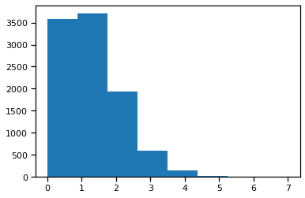
    


```python
from pymc3 import Normal
y = Normal.dist(mu=-2, sd=4)
samples = y.random(size=10000)
```


```python
samples.mean()
```


    -1.9853448415449464


```python
samples.std()
```


    4.001645659179313


```python
plt.hist(samples)
```


    (array([  11.,   82.,  508., 1723., 2821., 2818., 1525.,  432.,   70.,
              10.]),
     array([-17.57808292, -14.42397737, -11.26987182,  -8.11576627,
             -4.96166071,  -1.80755516,   1.34655039,   4.50065594,
              7.65476149,  10.80886704,  13.96297259]),
     <BarContainer object of 10 artists>)


    
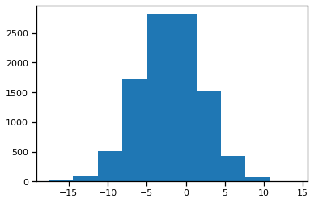
    


```python
radon = pd.read_csv('radon.csv', index_col=0)
```


```python
radon.head()
```


<div>
<style scoped>
    .dataframe tbody tr th:only-of-type {
        vertical-align: middle;
    }

    .dataframe tbody tr th {
        vertical-align: top;
    }

    .dataframe thead th {
        text-align: right;
    }
</style>
<table border="1" class="dataframe">
  <thead>
    <tr style="text-align: right;">
      <th></th>
      <th>idnum</th>
      <th>state</th>
      <th>state2</th>
      <th>stfips</th>
      <th>zip</th>
      <th>region</th>
      <th>typebldg</th>
      <th>floor</th>
      <th>room</th>
      <th>basement</th>
      <th>...</th>
      <th>pcterr</th>
      <th>adjwt</th>
      <th>dupflag</th>
      <th>zipflag</th>
      <th>cntyfips</th>
      <th>county</th>
      <th>fips</th>
      <th>Uppm</th>
      <th>county_code</th>
      <th>log_radon</th>
    </tr>
  </thead>
  <tbody>
    <tr>
      <th>0</th>
      <td>5081.0</td>
      <td>MN</td>
      <td>MN</td>
      <td>27.0</td>
      <td>55735</td>
      <td>5.0</td>
      <td>1.0</td>
      <td>1.0</td>
      <td>3.0</td>
      <td>N</td>
      <td>...</td>
      <td>9.7</td>
      <td>1146.499190</td>
      <td>1.0</td>
      <td>0.0</td>
      <td>1.0</td>
      <td>AITKIN</td>
      <td>27001.0</td>
      <td>0.502054</td>
      <td>0</td>
      <td>0.832909</td>
    </tr>
    <tr>
      <th>1</th>
      <td>5082.0</td>
      <td>MN</td>
      <td>MN</td>
      <td>27.0</td>
      <td>55748</td>
      <td>5.0</td>
      <td>1.0</td>
      <td>0.0</td>
      <td>4.0</td>
      <td>Y</td>
      <td>...</td>
      <td>14.5</td>
      <td>471.366223</td>
      <td>0.0</td>
      <td>0.0</td>
      <td>1.0</td>
      <td>AITKIN</td>
      <td>27001.0</td>
      <td>0.502054</td>
      <td>0</td>
      <td>0.832909</td>
    </tr>
    <tr>
      <th>2</th>
      <td>5083.0</td>
      <td>MN</td>
      <td>MN</td>
      <td>27.0</td>
      <td>55748</td>
      <td>5.0</td>
      <td>1.0</td>
      <td>0.0</td>
      <td>4.0</td>
      <td>Y</td>
      <td>...</td>
      <td>9.6</td>
      <td>433.316718</td>
      <td>0.0</td>
      <td>0.0</td>
      <td>1.0</td>
      <td>AITKIN</td>
      <td>27001.0</td>
      <td>0.502054</td>
      <td>0</td>
      <td>1.098612</td>
    </tr>
    <tr>
      <th>3</th>
      <td>5084.0</td>
      <td>MN</td>
      <td>MN</td>
      <td>27.0</td>
      <td>56469</td>
      <td>5.0</td>
      <td>1.0</td>
      <td>0.0</td>
      <td>4.0</td>
      <td>Y</td>
      <td>...</td>
      <td>24.3</td>
      <td>461.623670</td>
      <td>0.0</td>
      <td>0.0</td>
      <td>1.0</td>
      <td>AITKIN</td>
      <td>27001.0</td>
      <td>0.502054</td>
      <td>0</td>
      <td>0.095310</td>
    </tr>
    <tr>
      <th>4</th>
      <td>5085.0</td>
      <td>MN</td>
      <td>MN</td>
      <td>27.0</td>
      <td>55011</td>
      <td>3.0</td>
      <td>1.0</td>
      <td>0.0</td>
      <td>4.0</td>
      <td>Y</td>
      <td>...</td>
      <td>13.8</td>
      <td>433.316718</td>
      <td>0.0</td>
      <td>0.0</td>
      <td>3.0</td>
      <td>ANOKA</td>
      <td>27003.0</td>
      <td>0.428565</td>
      <td>1</td>
      <td>1.163151</td>
    </tr>
  </tbody>
</table>
<p>5 rows × 29 columns</p>
</div>


```python
hennepin_radon = radon.query('county=="HENNEPIN"').log_radon
sns.distplot(hennepin_radon)
```

    C:\Users\008010636\.conda\envs\pymc_env\lib\site-packages\seaborn\distributions.py:2619: FutureWarning: `distplot` is a deprecated function and will be removed in a future version. Please adapt your code to use either `displot` (a figure-level function with similar flexibility) or `histplot` (an axes-level function for histograms).
      warnings.warn(msg, FutureWarning)
    


    <AxesSubplot:xlabel='log_radon', ylabel='Density'>


    
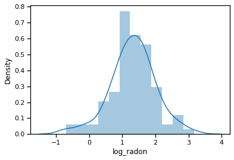
    


```python
hennepin_radon.shape
```


    (105,)


```python
from pymc3 import Model, Uniform
with Model() as radon_model:
    u = Normal('u', mu=0, sd=10)
    o = Uniform('o', 0, 10)
```


```python
with radon_model:
    y = Normal('y', mu=u, sd=o, observed=hennepin_radon)
```


```python
from pymc3 import fit
with radon_model:
    samples = fit(random_seed=RANDOM_SEED).sample(1000)
```


<style>
    /* Turns off some styling */
    progress {
        /* gets rid of default border in Firefox and Opera. */
        border: none;
        /* Needs to be in here for Safari polyfill so background images work as expected. */
        background-size: auto;
    }
    .progress-bar-interrupted, .progress-bar-interrupted::-webkit-progress-bar {
        background: #F44336;
    }
</style>


<div>
  <progress value='10000' class='' max='10000' style='width:300px; height:20px; vertical-align: middle;'></progress>
  100.00% [10000/10000 01:12<00:00 Average Loss = 136.32]
</div>


    Finished [100%]: Average Loss = 136.28
    


```python
from pymc3 import plot_posterior
plot_posterior(samples)
```

    Got error No model on context stack. trying to find log_likelihood in translation.
    C:\Users\008010636\.conda\envs\pymc_env\lib\site-packages\arviz\data\io_pymc3_3x.py:98: FutureWarning: Using `from_pymc3` without the model will be deprecated in a future release. Not using the model will return less accurate and less useful results. Make sure you use the model argument or call from_pymc3 within a model context.
      warnings.warn(
    


    array([<AxesSubplot:title={'center':'u'}>,
           <AxesSubplot:title={'center':'o'}>], dtype=object)


    
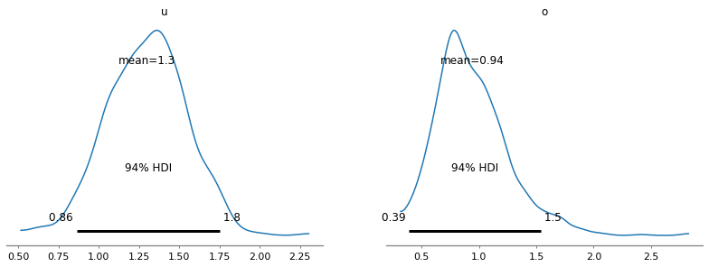
    


```python
mus = samples['u']
sigmas = samples['o']
mus
```


    array([1.53131507, 1.56109105, 1.72234075, 1.13420831, 1.49800077,
           1.09247596, 1.55106252, 1.13013325, 1.14491412, 1.06217339,
           1.28163899, 1.00952043, 1.21003981, 1.18211037, 1.38445231,
           1.07691127, 1.24214706, 1.10377994, 1.38687618, 1.76345766,
           1.31530154, 0.90453827, 1.01818578, 1.48130426, 1.29352035,
           1.02859088, 1.29412141, 1.20021434, 0.80169626, 1.18607294,
           1.00635498, 0.86834761, 1.07085746, 1.04970186, 1.13974038,
           1.53602917, 1.73102087, 2.30512882, 1.39807538, 1.69072625,
           1.36551644, 1.26956056, 1.68738876, 1.51241919, 1.06341051,
           1.45417002, 1.52825656, 1.3529094 , 1.27644388, 1.22694071,
           1.54603076, 1.03815693, 1.25396186, 1.48387023, 1.54661269,
           1.34727844, 0.92606102, 1.12887726, 1.40241216, 1.34276523,
           1.20281482, 2.02665289, 1.26176568, 1.59512887, 1.09456703,
           1.43280779, 1.15409063, 1.11752027, 0.51574104, 1.69944917,
           1.54371147, 1.21695355, 1.33468758, 1.43211511, 0.82584529,
           1.70740462, 1.41970146, 1.23476451, 1.50843032, 0.86526963,
           1.65574642, 1.68140664, 1.05292666, 1.09394758, 0.99122619,
           0.91282948, 1.06946403, 1.4095358 , 1.18058398, 1.6861297 ,
           1.06143772, 1.63554896, 1.04100094, 1.01720701, 1.17600431,
           1.16888894, 1.54564051, 1.66277663, 1.03761192, 1.67042049,
           1.42531374, 1.48635983, 1.37409493, 1.54739141, 1.44420122,
           1.47488342, 1.10270575, 1.8415245 , 1.332551  , 1.22806102,
           1.78320505, 0.93472006, 1.57287472, 0.92002014, 1.50368607,
           1.81817241, 1.26498452, 0.99550179, 1.24698574, 0.9003585 ,
           1.53844072, 1.48336145, 0.90671599, 1.15769804, 1.14650028,
           1.37918608, 1.26384604, 1.23056244, 1.68926692, 1.15070446,
           1.28470205, 1.25133554, 0.92090023, 1.08687679, 1.4226514 ,
           1.25735942, 1.33391365, 1.09378615, 1.18355583, 1.46947455,
           1.37496158, 1.00518878, 1.59796215, 0.79826712, 1.22141498,
           1.29851542, 1.32035299, 1.09393129, 1.08524892, 1.71819866,
           1.6463522 , 1.64050184, 1.45569028, 1.22698048, 1.12086984,
           1.47989786, 0.96936969, 1.31361924, 1.31715419, 1.94311413,
           1.11834743, 1.44910108, 1.22090137, 1.36364699, 1.10847094,
           1.57600452, 0.91102085, 1.35012756, 1.56560713, 1.26573846,
           1.13395005, 1.45370582, 1.71281238, 1.3380016 , 1.19242667,
           0.96537403, 0.83326281, 1.4016738 , 1.31012653, 1.32967431,
           1.10819927, 1.47646186, 1.42512008, 0.96014349, 1.4123663 ,
           1.13965752, 0.9348499 , 1.5835535 , 1.18109937, 1.32406403,
           0.86584925, 1.47549936, 1.47769336, 1.20732597, 1.68861007,
           1.46348326, 1.34119859, 1.6162813 , 1.22690105, 1.20364735,
           1.08428762, 1.32110296, 1.42606196, 1.20817434, 1.33983737,
           1.43528693, 1.27799744, 1.18362503, 1.58381644, 1.34315216,
           1.52341637, 1.3573232 , 1.07997322, 1.07878973, 1.41927209,
           1.35842987, 1.75137621, 1.40742407, 1.40847391, 1.78424096,
           1.17979788, 1.05477311, 1.40526143, 1.2543627 , 1.38471503,
           1.41451999, 1.97614374, 1.60806892, 1.10273937, 1.52614266,
           0.8319617 , 1.45275473, 1.29018473, 1.24809058, 1.33946131,
           1.3903217 , 1.51249089, 1.27091243, 1.22682409, 1.41058532,
           1.31117442, 1.54589878, 1.48078115, 1.47306509, 1.03794752,
           1.3095964 , 1.36366148, 1.09183214, 1.04206942, 1.49733574,
           1.31655931, 0.95567729, 1.14389326, 1.44287143, 1.73475826,
           0.99269331, 1.06224502, 1.06796351, 1.36400198, 1.00875717,
           1.30795629, 1.02944781, 1.26416282, 0.95899205, 1.36081825,
           1.32172363, 1.42425864, 1.11479793, 1.29048483, 1.47147101,
           1.46699249, 1.52413724, 1.21695435, 0.89453488, 1.64439507,
           1.21603047, 1.15166822, 1.28074233, 1.04297313, 0.87103963,
           1.46763171, 1.37168696, 1.1656237 , 1.70314645, 1.08093319,
           1.18637873, 1.46524502, 1.52164142, 1.38229371, 1.35517464,
           1.01698405, 1.67466312, 1.40182117, 1.52709897, 1.61718766,
           1.12441224, 1.31102068, 1.4739315 , 0.99315428, 1.2615889 ,
           1.59493356, 1.29795092, 1.21317934, 1.09835113, 1.4905789 ,
           1.50789324, 1.3301475 , 0.87693505, 1.57546305, 1.44981356,
           1.50339396, 0.93986331, 1.14646744, 1.11234741, 1.23203694,
           1.4152111 , 1.26591246, 1.18361081, 1.39899183, 1.31054655,
           1.2514892 , 1.42384877, 1.33428827, 1.52743189, 0.95532141,
           1.4744909 , 1.15761305, 1.18452228, 1.58478015, 1.18843556,
           1.19525968, 1.49160136, 1.04977216, 1.45492982, 1.43127238,
           1.22011229, 1.44398153, 1.15301938, 1.50561783, 1.6308571 ,
           1.15845391, 1.68643523, 1.16647329, 0.86002328, 1.26737921,
           1.07267515, 1.52322367, 1.78972996, 1.29459297, 1.27170315,
           1.78494137, 1.19671826, 1.20827661, 1.21466268, 1.2021298 ,
           0.79138218, 0.92949365, 0.97407172, 1.31463619, 1.25725687,
           1.29656996, 0.88340102, 1.12851376, 1.21610339, 1.7760372 ,
           1.78264627, 1.37418594, 1.05256042, 1.01365603, 1.55080987,
           1.84785309, 1.37591517, 1.51709387, 1.26462511, 1.21069346,
           1.40574442, 1.36022081, 1.46364275, 1.47148913, 1.30384494,
           1.2846924 , 1.65021381, 1.5952169 , 1.15507202, 1.33507805,
           1.1266353 , 1.12410983, 1.23311783, 1.10193268, 1.66854999,
           1.73065946, 1.1749545 , 1.15832832, 0.79111305, 1.26855978,
           0.98282028, 1.61898316, 1.32523869, 1.27245007, 0.6649795 ,
           1.43997726, 1.38844401, 1.68130283, 1.033978  , 1.09575952,
           1.08649916, 0.98874303, 1.42599006, 1.12775302, 1.55957864,
           1.05604006, 0.83029315, 1.08589322, 0.79636291, 1.52597697,
           1.2845769 , 0.93407667, 1.38064079, 1.49908602, 1.40682947,
           1.23475206, 1.16432709, 1.40932749, 1.67695857, 1.14686057,
           1.26320835, 1.69627899, 1.23087158, 1.20198755, 1.30390571,
           1.5353067 , 1.37860365, 1.54258669, 1.36337308, 1.48743053,
           1.00453148, 0.97563006, 1.00932057, 1.75103175, 1.1820599 ,
           1.47049173, 1.34785798, 1.3420597 , 1.08608413, 1.51420448,
           1.72293688, 1.57163971, 1.55499202, 1.43597948, 1.08018699,
           1.77075913, 1.1164648 , 1.42947984, 1.57544544, 0.892125  ,
           1.13726521, 1.34812728, 1.12059198, 1.41320234, 1.48134806,
           1.70411512, 1.38339199, 1.50454527, 1.28802571, 0.96785182,
           1.06886038, 1.77845206, 1.50777714, 0.85509215, 1.44149988,
           0.82146573, 1.2051257 , 1.17449395, 1.19604093, 1.48299523,
           1.0433804 , 1.5023661 , 0.99410833, 1.4280507 , 1.34103326,
           1.20492757, 1.32372171, 1.74721682, 1.46593441, 1.15647545,
           0.88251314, 1.62806857, 1.00467992, 1.39201297, 1.4171144 ,
           1.52498958, 1.71294403, 1.11180485, 1.07258386, 1.288197  ,
           1.35330229, 0.93589951, 1.37997553, 1.0507579 , 1.18151815,
           1.39384668, 1.43107927, 1.39802063, 1.7665481 , 1.27766329,
           1.60939189, 1.4255674 , 1.28348347, 1.28924171, 1.33282951,
           1.05865799, 1.15589187, 1.11009063, 1.53147635, 1.41395049,
           1.56168447, 1.57038851, 1.21893933, 1.34920962, 1.77943411,
           1.23114341, 0.96035794, 1.47076414, 1.12648211, 1.19756934,
           0.97712969, 1.50979319, 0.8444725 , 1.32448784, 1.26842912,
           1.03994296, 1.91002793, 1.34839599, 1.7867446 , 1.32068616,
           1.38443234, 1.44220261, 1.47361022, 1.26495105, 1.38853389,
           1.16951387, 0.58529539, 1.13240226, 1.09379393, 1.05311028,
           1.22053218, 1.30045764, 1.11908283, 1.37230077, 1.12566961,
           1.71814724, 1.76051846, 1.29433121, 1.52477066, 1.39988321,
           1.50568683, 1.44419845, 1.39783457, 1.14281013, 1.30653715,
           1.38854961, 1.03738786, 1.03583667, 0.99218578, 0.59121862,
           1.41776573, 1.41651688, 1.64534853, 1.64403256, 1.41340534,
           1.06818562, 1.69304608, 1.18859928, 1.18252464, 0.71313443,
           1.45502447, 1.14221633, 1.4939714 , 1.61555794, 0.96069344,
           1.33154008, 1.31627124, 1.56837275, 1.03733942, 0.86318525,
           1.04680841, 1.23901926, 1.54278529, 1.20627515, 1.79567484,
           1.35665101, 0.9572077 , 1.21462502, 1.68607811, 1.50419564,
           1.11441076, 1.21397251, 0.59864362, 0.86359539, 1.04786816,
           1.2498858 , 1.26590165, 1.56818973, 1.28348878, 1.00348382,
           1.57116937, 0.64679475, 0.93694366, 1.43786696, 1.54587721,
           1.37825016, 1.37153715, 1.51262697, 1.4065857 , 0.61851571,
           1.0642714 , 1.20324414, 0.80637233, 1.19559932, 1.41937218,
           1.07423006, 1.37719648, 1.21989316, 0.92858883, 1.31917762,
           1.35759357, 1.24064365, 1.45409788, 1.24146975, 1.53763571,
           1.29500869, 1.36936325, 1.20208732, 1.29561298, 1.12181882,
           1.73615495, 1.35688855, 0.96678085, 1.63238687, 1.53830334,
           1.646468  , 1.38248004, 1.44423106, 1.61080259, 1.02856676,
           1.27308925, 1.33959186, 1.17630704, 1.2062223 , 1.20155615,
           1.49783305, 1.44746759, 1.32540167, 1.00319214, 1.39484222,
           1.16361726, 1.45764984, 1.08154865, 1.47490157, 0.98468067,
           1.35513352, 1.24716897, 1.50017301, 1.07979529, 1.39841352,
           1.35353893, 1.20188927, 1.18459298, 1.00162074, 1.43109254,
           1.59937565, 1.49696905, 1.49410491, 1.15006119, 1.09474642,
           1.23627142, 1.29235624, 0.83398013, 1.28847316, 1.66361273,
           1.54842321, 1.67862278, 1.18230644, 1.14912157, 1.37123185,
           1.09655634, 1.40641368, 0.98469141, 1.1149198 , 0.86413021,
           1.28054899, 0.93191994, 1.06561299, 0.94770927, 1.52731181,
           1.30671503, 1.75297643, 0.89660854, 1.13649935, 1.24446243,
           1.36650673, 1.09870412, 1.38539121, 1.3221707 , 1.63846451,
           1.22753009, 1.19264102, 1.48611546, 1.65543848, 1.54402278,
           1.15793111, 1.68537369, 1.48298325, 1.38070075, 0.9556834 ,
           1.24077501, 1.16673647, 1.44152968, 1.53623479, 1.13394563,
           1.67842042, 1.0704582 , 1.57875482, 1.37925158, 1.46718232,
           1.20109328, 1.38324474, 1.49761529, 1.36413989, 1.17628274,
           0.92727681, 1.0450831 , 1.42907435, 1.63094165, 1.11950751,
           1.68827758, 1.4871079 , 1.42680757, 1.35485795, 1.26348588,
           1.38837133, 1.58191776, 1.43746517, 1.38674119, 1.30056958,
           1.31015766, 1.3489259 , 1.06161081, 0.82700117, 0.81837566,
           0.83326729, 1.12728816, 1.17437278, 1.1069754 , 1.20255772,
           1.03890291, 1.27446693, 1.34532738, 1.03409475, 1.03605564,
           0.65311848, 1.37961791, 1.26897952, 0.86687005, 1.38186171,
           0.99728517, 0.75698571, 1.33421504, 1.38946282, 1.37101764,
           1.56151395, 1.65015389, 0.68885888, 1.55140259, 1.328496  ,
           1.48237234, 1.38795909, 1.34654564, 1.07329086, 1.3132473 ,
           1.86859757, 1.53728391, 0.98062142, 1.52651955, 1.42577111,
           1.21669896, 1.20694709, 1.52154279, 1.08009215, 1.49581725,
           1.37983474, 1.25470039, 1.00545963, 1.37213625, 1.01108561,
           1.24509061, 1.25054816, 1.35812258, 1.40926234, 1.31756322,
           1.27487839, 1.31138583, 1.17743374, 0.90930335, 1.17079423,
           1.19291733, 1.2028105 , 1.5800617 , 1.20674173, 0.78036759,
           0.98637773, 1.5053193 , 1.42811508, 1.38423341, 1.08316524,
           1.51022785, 1.36493044, 1.67081269, 1.48794072, 1.39987998,
           1.31390155, 1.73010944, 0.97923419, 1.46646852, 1.63136567,
           1.4968539 , 0.94202713, 1.16710349, 1.45573402, 1.44206632,
           1.41698194, 0.88268796, 1.16797975, 1.36391808, 1.73417901,
           1.59334478, 1.27348633, 1.29288508, 1.35555246, 0.9311098 ,
           1.55750682, 1.45685065, 1.23773122, 1.04890429, 1.49975169,
           1.49258569, 1.24584748, 1.03879452, 1.20897694, 1.83622064,
           1.3587634 , 1.53410562, 1.05001694, 1.17566176, 1.37756886,
           1.57252923, 1.19567948, 1.10909522, 1.32452738, 0.96064803,
           1.55260961, 1.15872126, 1.23479923, 1.37339623, 1.57546748,
           1.51973478, 1.0372742 , 1.39959145, 1.26807709, 1.07629683,
           1.08046077, 1.20725589, 1.28265156, 1.0488479 , 1.72176297,
           1.50977126, 1.00852044, 1.49923605, 1.42078304, 1.1019488 ,
           1.31410236, 1.4027171 , 1.36701457, 1.06245591, 1.17918722,
           1.58657829, 1.35624332, 1.36531466, 1.47156507, 1.63070352,
           1.64737925, 1.31887731, 0.87350842, 1.24916635, 1.36475019,
           1.09652147, 1.38537218, 1.06830821, 1.26475931, 1.43491838,
           1.51675086, 1.53782027, 1.73646975, 1.25818565, 1.04474048,
           1.14281548, 1.26512763, 1.21322786, 1.61913917, 1.05733783,
           1.53463851, 1.27891643, 0.89373405, 1.42771082, 1.06109467,
           1.25535859, 1.18415583, 0.66654663, 1.22105204, 1.2896763 ,
           1.40363736, 1.13223066, 1.28542653, 1.03170401, 0.87219815,
           1.39018096, 1.33702085, 1.7310353 , 1.02137423, 1.52259976,
           1.35357383, 1.03107793, 1.42220111, 1.05230095, 1.25317438,
           1.32635239, 1.26704278, 1.4788694 , 1.35024411, 1.44760947,
           1.25135118, 1.41425896, 1.63120098, 1.23476077, 1.56433186,
           1.57172459, 1.23583153, 1.40977906, 1.08151012, 1.38833588,
           1.09821171, 1.11357726, 1.12725094, 1.19238202, 1.53636776,
           1.67589715, 1.18914916, 1.4210594 , 1.67867768, 1.28601385,
           1.63766662, 0.98988768, 1.61428373, 1.30951399, 1.22954428,
           1.3390742 , 1.16523155, 1.40224641, 1.3474805 , 1.35897135,
           1.21937128, 1.31334059, 1.32961783, 1.24502122, 1.37518661,
           1.0276272 , 1.48050762, 1.48070444, 1.00543011, 1.33966616,
           1.24585706, 1.29365811, 1.14630067, 1.72582374, 1.43316832,
           1.22718311, 0.66525683, 1.32014658, 1.34030349, 1.45719747,
           0.7206477 , 1.37912352, 1.05119734, 1.36424916, 0.95491639,
           1.7716302 , 1.5229974 , 1.21494219, 1.48784472, 0.95023659])


```python
radon_samples = Normal.dist(mus, sigmas).random()
```


```python
(radon_samples > np.log(4)).mean()
```


    0.432


```python
sns.distplot(radon_samples, label='simulated')
sns.distplot(hennepin_radon, label='observed')
plt.legend()
```

    C:\Users\008010636\.conda\envs\pymc_env\lib\site-packages\seaborn\distributions.py:2619: FutureWarning: `distplot` is a deprecated function and will be removed in a future version. Please adapt your code to use either `displot` (a figure-level function with similar flexibility) or `histplot` (an axes-level function for histograms).
      warnings.warn(msg, FutureWarning)
    C:\Users\008010636\.conda\envs\pymc_env\lib\site-packages\seaborn\distributions.py:2619: FutureWarning: `distplot` is a deprecated function and will be removed in a future version. Please adapt your code to use either `displot` (a figure-level function with similar flexibility) or `histplot` (an axes-level function for histograms).
      warnings.warn(msg, FutureWarning)
    


    <matplotlib.legend.Legend at 0x24f05c4c7c0>


    
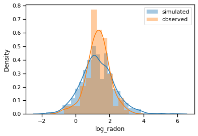
    


```python
from pymc3 import Flat, HalfCauchy

with Model() as prior_sensitivity:
    u = Flat('u')
    o = HalfCauchy('o', 5)
    dist = Normal('dist', mu=u, sd=o, observed=hennepin_radon)
    sensitivity_samples = fit(random_seed=RANDOM_SEED).sample(1000)
```


<style>
    /* Turns off some styling */
    progress {
        /* gets rid of default border in Firefox and Opera. */
        border: none;
        /* Needs to be in here for Safari polyfill so background images work as expected. */
        background-size: auto;
    }
    .progress-bar-interrupted, .progress-bar-interrupted::-webkit-progress-bar {
        background: #F44336;
    }
</style>


<div>
  <progress value='10000' class='' max='10000' style='width:300px; height:20px; vertical-align: middle;'></progress>
  100.00% [10000/10000 01:11<00:00 Average Loss = 123.98]
</div>


    Finished [100%]: Average Loss = 123.94
    


```python
plot_posterior(sensitivity_samples)
```

    Got error No model on context stack. trying to find log_likelihood in translation.
    C:\Users\008010636\.conda\envs\pymc_env\lib\site-packages\arviz\data\io_pymc3_3x.py:98: FutureWarning: Using `from_pymc3` without the model will be deprecated in a future release. Not using the model will return less accurate and less useful results. Make sure you use the model argument or call from_pymc3 within a model context.
      warnings.warn(
    


    array([<AxesSubplot:title={'center':'u'}>,
           <AxesSubplot:title={'center':'o'}>], dtype=object)


    
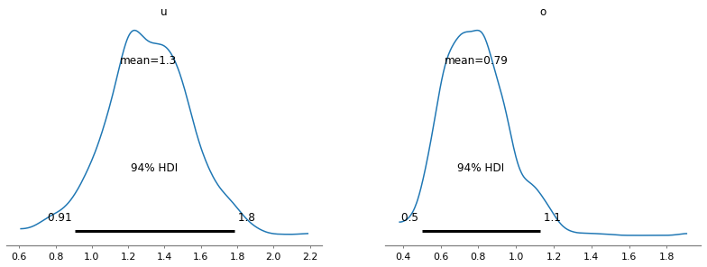
    


```python
plot_posterior(samples)
```

    Got error No model on context stack. trying to find log_likelihood in translation.
    C:\Users\008010636\.conda\envs\pymc_env\lib\site-packages\arviz\data\io_pymc3_3x.py:98: FutureWarning: Using `from_pymc3` without the model will be deprecated in a future release. Not using the model will return less accurate and less useful results. Make sure you use the model argument or call from_pymc3 within a model context.
      warnings.warn(
    


    array([<AxesSubplot:title={'center':'u'}>,
           <AxesSubplot:title={'center':'o'}>], dtype=object)


    

    


```python
drug = pd.DataFrame(dict(iq=(101,100,102,104,102,97,105,105,98,101,100,123,105,103,100,95,102,100,109,102,82,102,100,102,102,101,102,102,103,103,97,97,103,101,97,104,96,103,124,101,101,100,101,101,104,100,101), groups='drug'))
```


```python
placebo = pd.DataFrame(dict(iq=(99,101,100,101,102,100,97,101,104,101,102,102,100,105,88,101,100,104,100,100,100,101,102,103,97,101,101,100,101,99,101,100,100,101,100,99,101,100,102,99,100,99), groups='placebo'))
```


```python
trial_data = pd.concat([drug, placebo], ignore_index=True)
```


```python
trial_data.hist('iq', by='groups')
```


    array([<AxesSubplot:title={'center':'drug'}>,
           <AxesSubplot:title={'center':'placebo'}>], dtype=object)


    
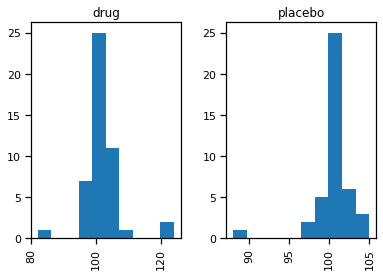
    


```python
from pymc3 import StudentT
```


```python
t = StudentT.dist(nu=3).random(size=10000)
n = Normal.dist(0, 1).random(size=10000)
```


```python
sns.distplot(t, label='Student-T')
sns.distplot(n, label='Normal')
plt.legend()
plt.xlim(-10, 10)
```

    C:\Users\008010636\.conda\envs\pymc_env\lib\site-packages\seaborn\distributions.py:2619: FutureWarning: `distplot` is a deprecated function and will be removed in a future version. Please adapt your code to use either `displot` (a figure-level function with similar flexibility) or `histplot` (an axes-level function for histograms).
      warnings.warn(msg, FutureWarning)
    C:\Users\008010636\.conda\envs\pymc_env\lib\site-packages\seaborn\distributions.py:2619: FutureWarning: `distplot` is a deprecated function and will be removed in a future version. Please adapt your code to use either `displot` (a figure-level function with similar flexibility) or `histplot` (an axes-level function for histograms).
      warnings.warn(msg, FutureWarning)
    


    (-10.0, 10.0)


    
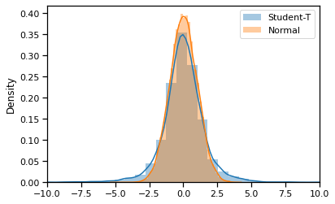
    


```python
with Model() as drug_model:
    u_0 = Normal('u_0', 100, sd=10)
    u_1 = Normal('u_1', 100, sd=10)
```


```python
with drug_model:
    o_0 = Uniform('o_0', lower=0, upper=20)
    o_1 = Uniform('o_1', lower=0, upper=20)
```


```python
from pymc3 import Exponential

with drug_model:
    v = Exponential('v_minus_one', 1/29.) + 1
```


```python
sns.distplot(Exponential.dist(1/29).random(size=10000), kde=False)
```

    C:\Users\008010636\.conda\envs\pymc_env\lib\site-packages\seaborn\distributions.py:2619: FutureWarning: `distplot` is a deprecated function and will be removed in a future version. Please adapt your code to use either `displot` (a figure-level function with similar flexibility) or `histplot` (an axes-level function for histograms).
      warnings.warn(msg, FutureWarning)
    


    <AxesSubplot:>


    
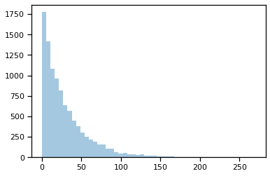
    


```python
from pymc3 import StudentT
with drug_model:
    drug_like = StudentT('drug_like', nu=v, mu=u_1, lam=o_1**-2, observed=drug.iq)
    placebo_like = StudentT('placebo_like', nu=v, mu=u_0, lam=o_0**-2, observed=placebo.iq)
```


```python
from pymc3 import Deterministic

with drug_model:
    diff_of_means = Deterministic('difference of means', u_1 - u_0)
    effect_size = Deterministic('effect size', diff_of_means / np.sqrt((o_1**2 + o_0**2) / 2))
```


```python
with drug_model:
    drug_trace = fit(random_seed=RANDOM_SEED).sample(1000)
```


<style>
    /* Turns off some styling */
    progress {
        /* gets rid of default border in Firefox and Opera. */
        border: none;
        /* Needs to be in here for Safari polyfill so background images work as expected. */
        background-size: auto;
    }
    .progress-bar-interrupted, .progress-bar-interrupted::-webkit-progress-bar {
        background: #F44336;
    }
</style>


<div>
  <progress value='10000' class='' max='10000' style='width:300px; height:20px; vertical-align: middle;'></progress>
  100.00% [10000/10000 02:08<00:00 Average Loss = 243.86]
</div>


    Finished [100%]: Average Loss = 243.87
    


```python
plot_posterior(drug_trace[100:], color='#87ceeb')
```

    Got error No model on context stack. trying to find log_likelihood in translation.
    C:\Users\008010636\.conda\envs\pymc_env\lib\site-packages\arviz\data\io_pymc3_3x.py:98: FutureWarning: Using `from_pymc3` without the model will be deprecated in a future release. Not using the model will return less accurate and less useful results. Make sure you use the model argument or call from_pymc3 within a model context.
      warnings.warn(
    


    array([[<AxesSubplot:title={'center':'u_0'}>,
            <AxesSubplot:title={'center':'u_1'}>,
            <AxesSubplot:title={'center':'o_0'}>],
           [<AxesSubplot:title={'center':'o_1'}>,
            <AxesSubplot:title={'center':'v_minus_one'}>,
            <AxesSubplot:title={'center':'difference of means'}>],
           [<AxesSubplot:title={'center':'effect size'}>, <AxesSubplot:>,
            <AxesSubplot:>]], dtype=object)


    

    


```python
plot_posterior(drug_trace[100:], ref_val=0, color='#87ceeb')
```

    Got error No model on context stack. trying to find log_likelihood in translation.
    C:\Users\008010636\.conda\envs\pymc_env\lib\site-packages\arviz\data\io_pymc3_3x.py:98: FutureWarning: Using `from_pymc3` without the model will be deprecated in a future release. Not using the model will return less accurate and less useful results. Make sure you use the model argument or call from_pymc3 within a model context.
      warnings.warn(
    


    array([[<AxesSubplot:title={'center':'u_0'}>,
            <AxesSubplot:title={'center':'u_1'}>,
            <AxesSubplot:title={'center':'o_0'}>],
           [<AxesSubplot:title={'center':'o_1'}>,
            <AxesSubplot:title={'center':'v_minus_one'}>,
            <AxesSubplot:title={'center':'difference of means'}>],
           [<AxesSubplot:title={'center':'effect size'}>, <AxesSubplot:>,
            <AxesSubplot:>]], dtype=object)


    
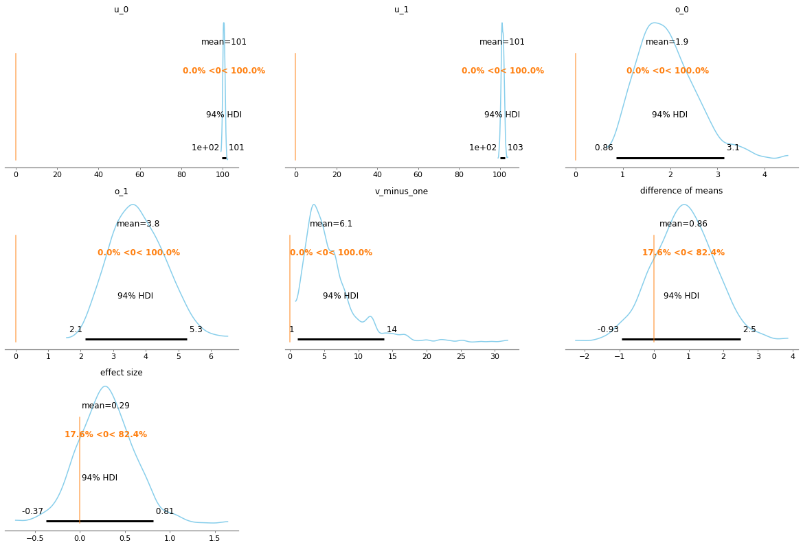
    


```python
nash_precip = pd.read_table('nashville_precip.txt', delimiter='\s+', na_values='NA', index_col=0)
nash_precip.head()
```


<div>
<style scoped>
    .dataframe tbody tr th:only-of-type {
        vertical-align: middle;
    }

    .dataframe tbody tr th {
        vertical-align: top;
    }

    .dataframe thead th {
        text-align: right;
    }
</style>
<table border="1" class="dataframe">
  <thead>
    <tr style="text-align: right;">
      <th></th>
      <th>Jan</th>
      <th>Feb</th>
      <th>Mar</th>
      <th>Apr</th>
      <th>May</th>
      <th>Jun</th>
      <th>Jul</th>
      <th>Aug</th>
      <th>Sep</th>
      <th>Oct</th>
      <th>Nov</th>
      <th>Dec</th>
    </tr>
    <tr>
      <th>Year</th>
      <th></th>
      <th></th>
      <th></th>
      <th></th>
      <th></th>
      <th></th>
      <th></th>
      <th></th>
      <th></th>
      <th></th>
      <th></th>
      <th></th>
    </tr>
  </thead>
  <tbody>
    <tr>
      <th>1871</th>
      <td>2.76</td>
      <td>4.58</td>
      <td>5.01</td>
      <td>4.13</td>
      <td>3.30</td>
      <td>2.98</td>
      <td>1.58</td>
      <td>2.36</td>
      <td>0.95</td>
      <td>1.31</td>
      <td>2.13</td>
      <td>1.65</td>
    </tr>
    <tr>
      <th>1872</th>
      <td>2.32</td>
      <td>2.11</td>
      <td>3.14</td>
      <td>5.91</td>
      <td>3.09</td>
      <td>5.17</td>
      <td>6.10</td>
      <td>1.65</td>
      <td>4.50</td>
      <td>1.58</td>
      <td>2.25</td>
      <td>2.38</td>
    </tr>
    <tr>
      <th>1873</th>
      <td>2.96</td>
      <td>7.14</td>
      <td>4.11</td>
      <td>3.59</td>
      <td>6.31</td>
      <td>4.20</td>
      <td>4.63</td>
      <td>2.36</td>
      <td>1.81</td>
      <td>4.28</td>
      <td>4.36</td>
      <td>5.94</td>
    </tr>
    <tr>
      <th>1874</th>
      <td>5.22</td>
      <td>9.23</td>
      <td>5.36</td>
      <td>11.84</td>
      <td>1.49</td>
      <td>2.87</td>
      <td>2.65</td>
      <td>3.52</td>
      <td>3.12</td>
      <td>2.63</td>
      <td>6.12</td>
      <td>4.19</td>
    </tr>
    <tr>
      <th>1875</th>
      <td>6.15</td>
      <td>3.06</td>
      <td>8.14</td>
      <td>4.22</td>
      <td>1.73</td>
      <td>5.63</td>
      <td>8.12</td>
      <td>1.60</td>
      <td>3.79</td>
      <td>1.25</td>
      <td>5.46</td>
      <td>4.30</td>
    </tr>
  </tbody>
</table>
</div>


```python
july_rain = nash_precip.Jul
jan_rain = nash_precip.Jan
```


```python
july_rain.hist()
```


    <AxesSubplot:>


    
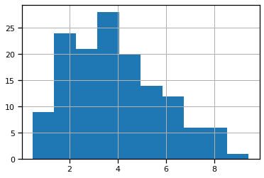
    


```python
from pymc3 import distributions
dir(distributions)
```


    ['AR',
     'AR1',
     'AsymmetricLaplace',
     'BART',
     'Bernoulli',
     'Beta',
     'BetaBinomial',
     'Binomial',
     'Bound',
     'Categorical',
     'Cauchy',
     'ChiSquared',
     'Constant',
     'ConstantDist',
     'Continuous',
     'DensityDist',
     'Dirichlet',
     'DirichletMultinomial',
     'Discrete',
     'DiscreteUniform',
     'DiscreteWeibull',
     'Distribution',
     'ExGaussian',
     'Exponential',
     'Flat',
     'GARCH11',
     'Gamma',
     'GaussianRandomWalk',
     'Geometric',
     'Gumbel',
     'HalfCauchy',
     'HalfFlat',
     'HalfNormal',
     'HalfStudentT',
     'HyperGeometric',
     'Interpolated',
     'InverseGamma',
     'KroneckerNormal',
     'Kumaraswamy',
     'LKJCholeskyCov',
     'LKJCorr',
     'Laplace',
     'LogNormal',
     'Logistic',
     'LogitNormal',
     'Lognormal',
     'MatrixNormal',
     'Mixture',
     'MixtureSameFamily',
     'Moyal',
     'Multinomial',
     'MvGaussianRandomWalk',
     'MvNormal',
     'MvStudentT',
     'MvStudentTRandomWalk',
     'NegativeBinomial',
     'NoDistribution',
     'Normal',
     'NormalMixture',
     'OrderedLogistic',
     'OrderedProbit',
     'Pareto',
     'Poisson',
     'Rice',
     'Simulator',
     'SkewNormal',
     'StudentT',
     'TensorType',
     'Triangular',
     'TruncatedNormal',
     'Uniform',
     'VonMises',
     'Wald',
     'Weibull',
     'Wishart',
     'WishartBartlett',
     'ZeroInflatedBinomial',
     'ZeroInflatedNegativeBinomial',
     'ZeroInflatedPoisson',
     '__all__',
     '__builtins__',
     '__cached__',
     '__doc__',
     '__file__',
     '__loader__',
     '__name__',
     '__package__',
     '__path__',
     '__spec__',
     'bart',
     'bound',
     'continuous',
     'discrete',
     'dist_math',
     'distribution',
     'draw_values',
     'fast_sample_posterior_predictive',
     'generate_samples',
     'mixture',
     'multivariate',
     'posterior_predictive',
     'shape_utils',
     'simulator',
     'special',
     'timeseries',
     'transforms',
     'tree']


```python
july_rain.apply(np.log).hist()
```


    <AxesSubplot:>


    
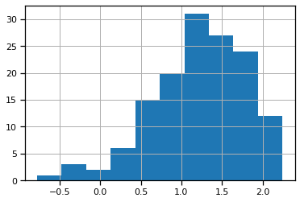
    


```python
from pymc3 import Gamma
with Model() as rainfall_model:
    σ = Uniform('σ', 0, 1000)
    mu_jan = Uniform('mu_jan', 0, 25)
    mu_jul = Uniform('mu_jul', 0, 25)
    
    jan = Gamma('jan', mu=mu_jan, sd=σ, observed=jan_rain)
    jul = Gamma('jul', mu=mu_jul, sd=σ, observed=july_rain)
    
    d = Deterministic('d', mu_jan - mu_jul)
```


```python
with rainfall_model:
    samples = fit(20000).sample(1000)
```


<style>
    /* Turns off some styling */
    progress {
        /* gets rid of default border in Firefox and Opera. */
        border: none;
        /* Needs to be in here for Safari polyfill so background images work as expected. */
        background-size: auto;
    }
    .progress-bar-interrupted, .progress-bar-interrupted::-webkit-progress-bar {
        background: #F44336;
    }
</style>


<div>
  <progress value='20000' class='' max='20000' style='width:300px; height:20px; vertical-align: middle;'></progress>
  100.00% [20000/20000 03:53<00:00 Average Loss = 911.22]
</div>


    Finished [100%]: Average Loss = 911.11
    


```python
plot_posterior(samples)
```

    Got error No model on context stack. trying to find log_likelihood in translation.
    C:\Users\008010636\.conda\envs\pymc_env\lib\site-packages\arviz\data\io_pymc3_3x.py:98: FutureWarning: Using `from_pymc3` without the model will be deprecated in a future release. Not using the model will return less accurate and less useful results. Make sure you use the model argument or call from_pymc3 within a model context.
      warnings.warn(
    


    array([<AxesSubplot:title={'center':'σ'}>,
           <AxesSubplot:title={'center':'mu_jan'}>,
           <AxesSubplot:title={'center':'mu_jul'}>,
           <AxesSubplot:title={'center':'d'}>], dtype=object)


    
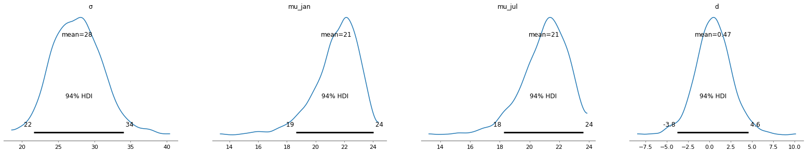
    


```python
vlbw = pd.read_csv('vlbw.csv', index_col=0).dropna(axis=0, subset=['ivh', 'pneumo'])
vlbw.head()
```


<div>
<style scoped>
    .dataframe tbody tr th:only-of-type {
        vertical-align: middle;
    }

    .dataframe tbody tr th {
        vertical-align: top;
    }

    .dataframe thead th {
        text-align: right;
    }
</style>
<table border="1" class="dataframe">
  <thead>
    <tr style="text-align: right;">
      <th></th>
      <th>birth</th>
      <th>exit</th>
      <th>hospstay</th>
      <th>lowph</th>
      <th>pltct</th>
      <th>race</th>
      <th>bwt</th>
      <th>gest</th>
      <th>inout</th>
      <th>twn</th>
      <th>...</th>
      <th>vent</th>
      <th>pneumo</th>
      <th>pda</th>
      <th>cld</th>
      <th>pvh</th>
      <th>ivh</th>
      <th>ipe</th>
      <th>year</th>
      <th>sex</th>
      <th>dead</th>
    </tr>
  </thead>
  <tbody>
    <tr>
      <th>5</th>
      <td>81.593002</td>
      <td>81.598999</td>
      <td>2.0</td>
      <td>6.969997</td>
      <td>54.0</td>
      <td>black</td>
      <td>925.0</td>
      <td>28.0</td>
      <td>born at Duke</td>
      <td>0.0</td>
      <td>...</td>
      <td>1.0</td>
      <td>1.0</td>
      <td>0.0</td>
      <td>0.0</td>
      <td>definite</td>
      <td>definite</td>
      <td>NaN</td>
      <td>81.594055</td>
      <td>female</td>
      <td>1</td>
    </tr>
    <tr>
      <th>6</th>
      <td>81.601997</td>
      <td>81.771004</td>
      <td>62.0</td>
      <td>7.189999</td>
      <td>NaN</td>
      <td>white</td>
      <td>940.0</td>
      <td>28.0</td>
      <td>born at Duke</td>
      <td>0.0</td>
      <td>...</td>
      <td>1.0</td>
      <td>0.0</td>
      <td>0.0</td>
      <td>0.0</td>
      <td>absent</td>
      <td>absent</td>
      <td>absent</td>
      <td>81.602295</td>
      <td>female</td>
      <td>0</td>
    </tr>
    <tr>
      <th>13</th>
      <td>81.683998</td>
      <td>81.853996</td>
      <td>62.0</td>
      <td>7.179996</td>
      <td>182.0</td>
      <td>black</td>
      <td>1110.0</td>
      <td>28.0</td>
      <td>born at Duke</td>
      <td>0.0</td>
      <td>...</td>
      <td>0.0</td>
      <td>1.0</td>
      <td>0.0</td>
      <td>1.0</td>
      <td>absent</td>
      <td>absent</td>
      <td>absent</td>
      <td>81.684448</td>
      <td>male</td>
      <td>0</td>
    </tr>
    <tr>
      <th>14</th>
      <td>81.689003</td>
      <td>81.877998</td>
      <td>69.0</td>
      <td>7.419998</td>
      <td>361.0</td>
      <td>white</td>
      <td>1180.0</td>
      <td>28.0</td>
      <td>born at Duke</td>
      <td>0.0</td>
      <td>...</td>
      <td>0.0</td>
      <td>0.0</td>
      <td>0.0</td>
      <td>0.0</td>
      <td>absent</td>
      <td>absent</td>
      <td>absent</td>
      <td>81.689880</td>
      <td>male</td>
      <td>0</td>
    </tr>
    <tr>
      <th>16</th>
      <td>81.696999</td>
      <td>81.952004</td>
      <td>93.0</td>
      <td>7.239998</td>
      <td>255.0</td>
      <td>black</td>
      <td>770.0</td>
      <td>26.0</td>
      <td>born at Duke</td>
      <td>0.0</td>
      <td>...</td>
      <td>1.0</td>
      <td>0.0</td>
      <td>0.0</td>
      <td>1.0</td>
      <td>absent</td>
      <td>absent</td>
      <td>absent</td>
      <td>81.698120</td>
      <td>male</td>
      <td>0</td>
    </tr>
  </tbody>
</table>
<p>5 rows × 26 columns</p>
</div>


```python
pd.crosstab(vlbw.ivh, vlbw.pneumo)
```


<div>
<style scoped>
    .dataframe tbody tr th:only-of-type {
        vertical-align: middle;
    }

    .dataframe tbody tr th {
        vertical-align: top;
    }

    .dataframe thead th {
        text-align: right;
    }
</style>
<table border="1" class="dataframe">
  <thead>
    <tr style="text-align: right;">
      <th>pneumo</th>
      <th>0.0</th>
      <th>1.0</th>
    </tr>
    <tr>
      <th>ivh</th>
      <th></th>
      <th></th>
    </tr>
  </thead>
  <tbody>
    <tr>
      <th>absent</th>
      <td>359</td>
      <td>73</td>
    </tr>
    <tr>
      <th>definite</th>
      <td>45</td>
      <td>30</td>
    </tr>
    <tr>
      <th>possible</th>
      <td>6</td>
      <td>4</td>
    </tr>
  </tbody>
</table>
</div>


```python
ivh = vlbw.ivh.isin(['definite', 'possible']).astype(int).values
x = vlbw.pneumo.astype(int).values
```


```python
from pymc3 import Beta
params = (5, 1), (1, 3), (5, 5), (0.5, 0.5), (1, 1)

fig, axes = plt.subplots(1, len(params), figsize=(14, 4), sharey=True)
for ax, (alpha, beta) in zip(axes, params):
    sns.distplot(Beta.dist(alpha, beta).random(size=10000), ax=ax, kde=False)
    ax.set_xlim(0, 1)
    ax.set_title(r'$\alpha={0}, \beta={1}$'.format(alpha, beta))
```

    C:\Users\008010636\.conda\envs\pymc_env\lib\site-packages\seaborn\distributions.py:2619: FutureWarning: `distplot` is a deprecated function and will be removed in a future version. Please adapt your code to use either `displot` (a figure-level function with similar flexibility) or `histplot` (an axes-level function for histograms).
      warnings.warn(msg, FutureWarning)
    


    
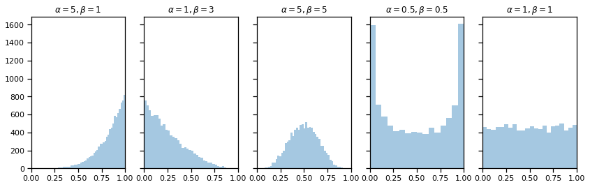
    


```python
with Model() as ivh_model:
    p = Beta('p', 1, 1, shape=2)
```


```python
from pymc3 import Bernoulli

with ivh_model:
    bb_like = Bernoulli('bb_like', p=p[x], observed=ivh)
```


```python
with ivh_model:
    ivh_trace = fit(random_seed=RANDOM_SEED).sample(1000)
```


<style>
    /* Turns off some styling */
    progress {
        /* gets rid of default border in Firefox and Opera. */
        border: none;
        /* Needs to be in here for Safari polyfill so background images work as expected. */
        background-size: auto;
    }
    .progress-bar-interrupted, .progress-bar-interrupted::-webkit-progress-bar {
        background: #F44336;
    }
</style>


<div>
  <progress value='10000' class='' max='10000' style='width:300px; height:20px; vertical-align: middle;'></progress>
  100.00% [10000/10000 04:14<00:00 Average Loss = 226.71]
</div>


    Finished [100%]: Average Loss = 226.71
    


```python
plot_posterior(ivh_trace[100:], color='#87ceeb')
```

    Got error No model on context stack. trying to find log_likelihood in translation.
    C:\Users\008010636\.conda\envs\pymc_env\lib\site-packages\arviz\data\io_pymc3_3x.py:98: FutureWarning: Using `from_pymc3` without the model will be deprecated in a future release. Not using the model will return less accurate and less useful results. Make sure you use the model argument or call from_pymc3 within a model context.
      warnings.warn(
    


    array([<AxesSubplot:title={'center':'p\n0'}>,
           <AxesSubplot:title={'center':'p\n1'}>], dtype=object)


    
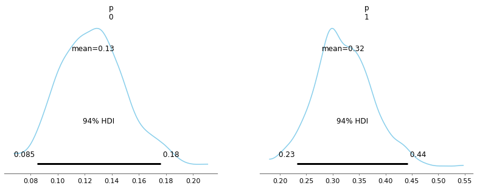
    


```python
plot_posterior(ivh_trace[100:], ref_val=0, color='#87ceeb')
```

    Got error No model on context stack. trying to find log_likelihood in translation.
    C:\Users\008010636\.conda\envs\pymc_env\lib\site-packages\arviz\data\io_pymc3_3x.py:98: FutureWarning: Using `from_pymc3` without the model will be deprecated in a future release. Not using the model will return less accurate and less useful results. Make sure you use the model argument or call from_pymc3 within a model context.
      warnings.warn(
    


    array([<AxesSubplot:title={'center':'p\n0'}>,
           <AxesSubplot:title={'center':'p\n1'}>], dtype=object)


    
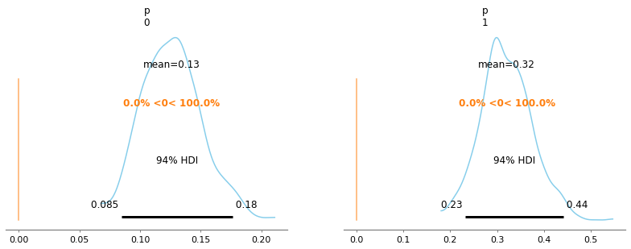
    


```python
# From this assignment, I gained understanding on how I can apply statistics to gain meaningful information 
# from a data set. For example, I learned how to apply and test various distributions to a data set, and then 
# use this information to make predictions. I feel this will be helpful when we start to investigate mining 
# and analyzing real-world data. Even with all the data in the world, not knowing to use it to make predictions 
# or create knowledge will not be helpful. 
```

## Jonathan Doolittle


```python

```
