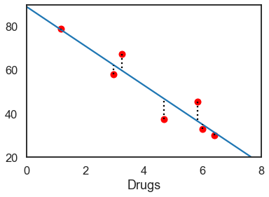
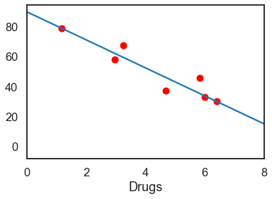
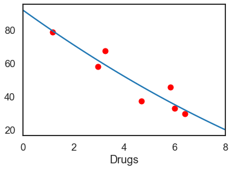
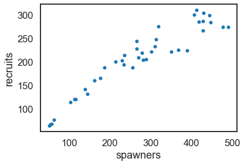
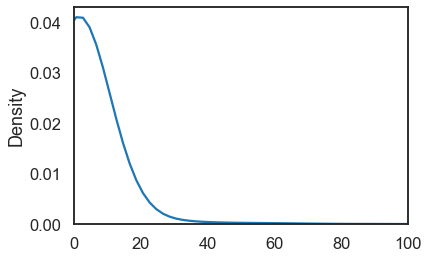
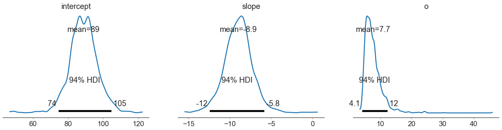
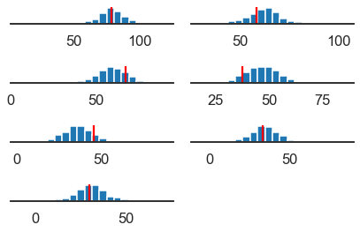

```python
%matplotlib inline
import numpy as np
import pandas as pd
import matplotlib.pyplot as plt
from scipy.optimize import fmin
import seaborn as sns
sns.set_context('talk')
sns.set_style('white')

RANDOM_SEED = 20090425
```


```python
from io import StringIO
```


```python
data_string = """
Drugs   Score
0   1.17   78.93
1   2.97   58.20
2   3.26   67.47
3   4.69   37.47
4   5.83   45.65
5   6.00   32.92
6   6.41   29.97
"""
```


```python
lsd_and_math = pd.read_table(StringIO(data_string), sep="\s+", index_col=0)
```


```python
lsd_and_math
```


<div>
<style scoped>
    .dataframe tbody tr th:only-of-type {
        vertical-align: middle;
    }

    .dataframe tbody tr th {
        vertical-align: top;
    }

    .dataframe thead th {
        text-align: right;
    }
</style>
<table border="1" class="dataframe">
  <thead>
    <tr style="text-align: right;">
      <th></th>
      <th>Drugs</th>
      <th>Score</th>
    </tr>
  </thead>
  <tbody>
    <tr>
      <th>0</th>
      <td>1.17</td>
      <td>78.93</td>
    </tr>
    <tr>
      <th>1</th>
      <td>2.97</td>
      <td>58.20</td>
    </tr>
    <tr>
      <th>2</th>
      <td>3.26</td>
      <td>67.47</td>
    </tr>
    <tr>
      <th>3</th>
      <td>4.69</td>
      <td>37.47</td>
    </tr>
    <tr>
      <th>4</th>
      <td>5.83</td>
      <td>45.65</td>
    </tr>
    <tr>
      <th>5</th>
      <td>6.00</td>
      <td>32.92</td>
    </tr>
    <tr>
      <th>6</th>
      <td>6.41</td>
      <td>29.97</td>
    </tr>
  </tbody>
</table>
</div>


```python
sum_of_squares = lambda o, x, y,: np.sum((y - o[0] - o[1]*x) **2)
```


```python
sum_of_squares([0,1], lsd_and_math.Drugs, lsd_and_math.Score)
```


    17159.8154


```python
x, y = lsd_and_math.T.values
b0, b1 = fmin(sum_of_squares, [0, 1], args=(x, y))
b0, b1
```

    Optimization terminated successfully.
             Current function value: 253.881329
             Iterations: 97
             Function evaluations: 179
    


    (89.12390920980424, -9.00946965833095)


```python
ax = lsd_and_math.plot(x='Drugs', y='Score', style='ro', legend=False, xlim=(0,8), ylim=(20,90))
ax.plot([0,10], [b0, b0+b1*10])
for xi, yi in zip(x,y):
    ax.plot([xi]*2, [yi, b0+b1*xi], 'k:')
```


    

    


```python
sum_of_absval = lambda o, x, y: np.sum(np.abs(y - o[0] - o[1]*x))
```


```python
b0, b1 = fmin(sum_of_absval, [0,0], args=(x,y))
print('\nintercept:  {0:.2}, slope:  {1:.2}'.format(b0,b1))
ax = lsd_and_math.plot(x='Drugs', y='Score', style='ro', legend=False, xlim=(0,8))
ax.plot([0,10], [b0, b0+b1*10])
```

    Optimization terminated successfully.
             Current function value: 31.692066
             Iterations: 137
             Function evaluations: 264
    
    intercept:  9e+01, slope:  -9.3
    


    [<matplotlib.lines.Line2D at 0x241ae71cf70>]


    

    


```python
sum_squares_quad = lambda o, x, y: np.sum((y - o[0] - o[1]*x - o[2]*(x**2)) **2)
```


```python
b0, b1, b2 = fmin(sum_squares_quad, [1, 1, -1], args=(x,y))
print('\nintercept:  {0:.2}, x:  {1:.2}, x2:  {2:.2}'.format(b0,b1, b2))
ax = lsd_and_math.plot(x='Drugs', y='Score', style='ro', legend=False, xlim=(0,8))
xvals = np.linspace(0, 8, 100)
ax.plot(xvals, b0 + b1*xvals + b2*(xvals**2))
```

    Optimization terminated successfully.
             Current function value: 251.093792
             Iterations: 177
             Function evaluations: 319
    
    intercept:  9.2e+01, x:  -1.1e+01, x2:  0.24
    


    [<matplotlib.lines.Line2D at 0x241ae769ae0>]


    

    


```python
salmon = pd.read_table("salmon.dat", delim_whitespace=True, index_col=0)
salmon.plot.scatter(x='spawners', y='recruits');
```


    

    


```python
from pymc3 import HalfCauchy

ax = sns.kdeplot(HalfCauchy.dist(1).random(size=10000), gridsize=2000)
ax.set_xlim(0, 100)
```


    (0.0, 100.0)


    

    


```python
from pymc3 import Normal, Model

with Model() as drugs_model:
    
    intercept = Normal('intercept', 0, sd=100)
    slope = Normal('slope', 0, sd=100)
    o = HalfCauchy('o', 1)
```


```python
with drugs_model:
    u = intercept + slope * x
    score = Normal('score', u, sd=o, observed=y)
```


```python
from pymc3 import sample

with drugs_model:
    drugs_sample = sample(1000, random_seed=RANDOM_SEED)
```

    C:\Users\008010636\.conda\envs\pymc_env\lib\site-packages\deprecat\classic.py:215: FutureWarning: In v4.0, pm.sample will return an `arviz.InferenceData` object instead of a `MultiTrace` by default. You can pass return_inferencedata=True or return_inferencedata=False to be safe and silence this warning.
      return wrapped_(*args_, **kwargs_)
    Auto-assigning NUTS sampler...
    Initializing NUTS using jitter+adapt_diag...
    C:\Users\008010636\.conda\envs\pymc_env\lib\site-packages\theano\tensor\elemwise.py:826: RuntimeWarning: divide by zero encountered in log
      variables = ufunc(*ufunc_args, **ufunc_kwargs)
    C:\Users\008010636\.conda\envs\pymc_env\lib\site-packages\theano\tensor\elemwise.py:826: RuntimeWarning: invalid value encountered in multiply
      variables = ufunc(*ufunc_args, **ufunc_kwargs)
    Multiprocess sampling (4 chains in 4 jobs)
    NUTS: [o, slope, intercept]
    


<style>
    /* Turns off some styling */
    progress {
        /* gets rid of default border in Firefox and Opera. */
        border: none;
        /* Needs to be in here for Safari polyfill so background images work as expected. */
        background-size: auto;
    }
    .progress-bar-interrupted, .progress-bar-interrupted::-webkit-progress-bar {
        background: #F44336;
    }
</style>


<div>
  <progress value='8000' class='' max='8000' style='width:300px; height:20px; vertical-align: middle;'></progress>
  100.00% [8000/8000 00:48<00:00 Sampling 4 chains, 75 divergences]
</div>


    Sampling 4 chains for 1_000 tune and 1_000 draw iterations (4_000 + 4_000 draws total) took 64 seconds.
    There were 63 divergences after tuning. Increase `target_accept` or reparameterize.
    The acceptance probability does not match the target. It is 0.6173466884478626, but should be close to 0.8. Try to increase the number of tuning steps.
    There were 10 divergences after tuning. Increase `target_accept` or reparameterize.
    The acceptance probability does not match the target. It is 0.7212742054321954, but should be close to 0.8. Try to increase the number of tuning steps.
    There were 2 divergences after tuning. Increase `target_accept` or reparameterize.
    The number of effective samples is smaller than 25% for some parameters.
    


```python
from pymc3 import plot_posterior

plot_posterior(drugs_sample[500:]);
```

    Got error No model on context stack. trying to find log_likelihood in translation.
    C:\Users\008010636\.conda\envs\pymc_env\lib\site-packages\arviz\data\io_pymc3_3x.py:98: FutureWarning: Using `from_pymc3` without the model will be deprecated in a future release. Not using the model will return less accurate and less useful results. Make sure you use the model argument or call from_pymc3 within a model context.
      warnings.warn(
    


    

    


```python
from pymc3 import sample_ppc

with drugs_model:
    drugs_ppc = sample_ppc(drugs_sample, 1000)
```


    ---------------------------------------------------------------------------

    ImportError                               Traceback (most recent call last)

    Input In [43], in <cell line: 1>()
    ----> 1 from pymc3 import sample_ppc
          3 with drugs_model:
          4     drugs_ppc = sample_ppc(drugs_sample, 1000)
    

    ImportError: cannot import name 'sample_ppc' from 'pymc3' (C:\Users\008010636\.conda\envs\pymc_env\lib\site-packages\pymc3\__init__.py)


```python
from pymc3 import sample_posterior_predictive

with drugs_model:
    drugs_ppc = sample_posterior_predictive(drugs_sample, 1000)
```

    C:\Users\008010636\.conda\envs\pymc_env\lib\site-packages\pymc3\sampling.py:1708: UserWarning: samples parameter is smaller than nchains times ndraws, some draws and/or chains may not be represented in the returned posterior predictive sample
      warnings.warn(
    


<style>
    /* Turns off some styling */
    progress {
        /* gets rid of default border in Firefox and Opera. */
        border: none;
        /* Needs to be in here for Safari polyfill so background images work as expected. */
        background-size: auto;
    }
    .progress-bar-interrupted, .progress-bar-interrupted::-webkit-progress-bar {
        background: #F44336;
    }
</style>


<div>
  <progress value='1000' class='' max='1000' style='width:300px; height:20px; vertical-align: middle;'></progress>
  100.00% [1000/1000 00:01<00:00]
</div>


```python
drugs_ppc['score'].shape
```


    (1000, 7)


```python
fig, axes = plt.subplots(4, 2)
axes_flat = axes.flatten()

for ax, real_data,  sim_data in zip(axes_flat[:-1], y, drugs_ppc['score'].T):
    ax.hist(sim_data, bins=20)
    ax.vlines(real_data,  *ax.get_ylim(), colors='red')
    ax.set_yticklabels([])
    sns.despine(left=True)
    
axes_flat[-1].axis('off')
plt.tight_layout()
```


    

    


## Jonathan Doolittle


```python

```
